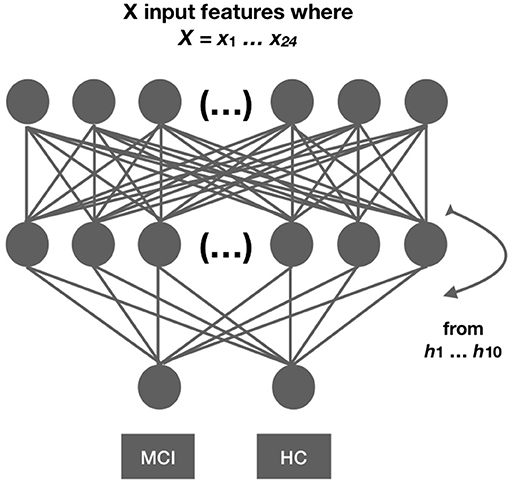

Journal paper available at [Frontiers Neurology](https://www.frontiersin.org/articles/10.3389/fneur.2018.00975/full)

* Update (2/3/18): Modified by adding new comparisons.

* Update (6/1/18): Updated to work with the newer version of TensorFlow.

* Update (8/3/18): Jupyter Notebook Converted to py file with cells.

# Introduction
This paper contains code for comparing different structures of neural networks with a different number of hidden layers. 

# Prerequisites
This project requires scikit-learn, TensorFlow, and Keras, data are analyzed using NumPy, pandas, and visualize with Matplotlib. Most of these packages are included in the Anaconda Environment. 

To Install Anaconda, please visit the [official website](https://www.anaconda.com/distribution/) for instructions. 

To install [Keras]

> conda install -c keras

# Development
The original code was written using Jupyter Notebooks. The current form is employed 

# Data Availability
The data contain information about patients' productions that may be employed to identify the patients. Therefore, they cannot be released in this project, based on the Ethics Agreement. Nevertheless, you may use the code using your own data.

# Ethics
Ethic approvals for the study were obtained by the local ethical committee review board (reference number: L091-99, 1999; T479-11, 2011); while the currently described study was approved by the local ethical committee decision 206-16, 2016. For more information see Riksbankens Jubileumsfond – The Swedish Foundation for Humanities and Social Sciences, through the grant agreement no: NHS 14-1761:1. 

# Funding
This research has been funded by Riksbankens Jubileumsfond – The Swedish Foundation for Humanities and Social Sciences, through the grant agreement no: NHS 14-1761:1.

# Conflict of Interest Statement
The authors declare that the research was conducted in the absence of any commercial or financial relationships that could be construed as a potential conflict of interest.